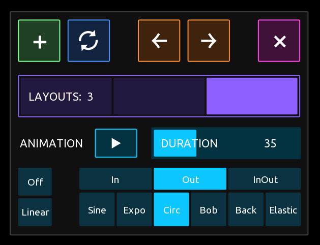

# TouchOSC
These are tools and modules I developed for the [TouchOSC](https://hexler.net/touchosc) app. TouchOSC is a powerful surface builder with a LUA scripting api to process Midi and OSC messages.
  - [Animated Layouts](#animator)
  - [Retro Segment and Dot display](#retro-segment-and-dot-display)
  - [Text Input Dialog](#text-input)
  - [Color Picker Dialog](#color-picker)
  - [LUA Script Minifier](#lua-script-minifier)
  - [Channel Mapper](#channel-mapper)
  - [Pickup Radial](#pickup-radial)
  - [Pan and Zoom](#pan-and-zoom)
  - [Swipe Pager](#swipe-pager)
  - [Miscellaneous](#miscellaneous)

## Animator
A tool to create animated layout transitions! You can setup up to 20 different layouts in your template and choose from a variety of animations to transit between them.
This is useful to support user preferences (layout mirroring, easy/advanced settings, vetical vs. horizontal layout etc.) but also to just make you template more vivid.
The Animator panel provides a simple visual interface to add and remove layouts and animations.    
For more details see the [description in the module folder](https://github.com/tshoppa/touchOSC/blob/main/modules/animator/).

<video src="https://github.com/user-attachments/assets/8604f81a-bb3c-431e-8af3-2e9240db9685"></video>

## Retro Segment and Dot display
A 7 segment display and a 5x7 dot display to bring the retro charme to your touchOSC template. 
For more details see the [description in the module folder](https://github.com/tshoppa/touchOSC/blob/main/modules/SegmentDisplay/).

<video src="https://github.com/user-attachments/assets/afd843cd-16c9-4058-ba14-b191283386a3"></video>
<video src="https://github.com/user-attachments/assets/d02941ce-0ade-4721-b964-2d1d904c736a"></video>

## Text Input
A dialog to edit text for labels, text controls or OSC messages.
It features lower and uppercase characters as well as a range of symbols. The keyboard layout is QUERTY (for characters, the symbols are more or less random).
For more details see the [description in the module folder](https://github.com/tshoppa/touchOSC/blob/main/modules/TextInputDialog/).

## Color Picker
A dialog to select colors from an RGB color space representation (similar to the color selector in the touchOSC editor itself). 
I wanted colors in an app to be configurable by the user, but picking a color by changing individual RGB channels (e.g. by 3 separate faders) is quite tedious.
The color picker provides an intuitive WYSIWYG color selection aproach, faders for opacity and fine adjustment, a history of last selected colors and a grascale switch.  
For more details see the [description in the module folder](https://github.com/tshoppa/touchOSC/blob/main/modules/ColorPicker/).

## Lua Script Minifier
compresses the script code in a template, making the code around 50% smaller and slightly more efficent.
Also helps to protect from copycat in case you are selling templates.
For more details see the [description in the module folder](https://github.com/tshoppa/touchOSC/blob/main/modules/minifier/).

## Channel Mapper
simple, mobile friendly midi channel mapper
It will map messages coming in on connection 1 to the channels as defined in the boxes and resend them on connection 2 - 5. Likewise, incoming messages on connections 2-5 are mapped backwards to connection 1.
You can also save and load up to 16 configurations.

For more details see the [description in the module folder](https://github.com/tshoppa/touchOSC/blob/main/modules/Midi%20Mapper/).

## Pickup Radial
A soft sync solution when using additional (non motorized) hardware controller (like an Akai Midimix or a Novation LaunchControl XL) to control a touchOSC template.
When you turn an out of sync knob on your hw and it is not in sync whith the corresponding radial in touchOSC a white "ghost" radial will appear until knob and radial are in sync.
This avoids hard value jumps. 
The scripts can be easily transfered to faders.
[Pickup Radial](https://github.com/tshoppa/touchOSC/blob/main/modules/Pickup/Pickup.tosc)

## Pan and Zoom
POC how to zoom into a template with a pinch gesture and pan with a drag gesture. Watch it on facebook:

[PanZoom](https://github.com/tshoppa/touchOSC/blob/main/modules/Pan%20and%20Zoom/PanZoom.tosc)

## Swipe Pager
Pager-like container that works on a swipe gesture to scroll through pages. Watch it on facebook:

[SwipePager](https://github.com/tshoppa/touchOSC/blob/main/modules/misc/Swipe.tosc)

## Miscellaneous
various smaller tools, scripts and components 

- [**ButtonRadio**](https://github.com/tshoppa/touchOSC/blob/main/modules/misc/ButtonRadio.tosc) Group of buttons that behaves like a Radio
- [**Button Trigger workflow**](https://github.com/tshoppa/touchOSC/blob/main/modules/misc/ButtonTriggerWorkflow.tosc) small diagramm that shows how local messages and scripts trigger events
- [**FlexPager**](https://github.com/tshoppa/touchOSC/blob/main/modules/misc/FlexPager.tosc) A Pager with a (virtually) variable number of pages (TouchOSC doesn't allow to actually add or remove pages in runtime, but this pager simulates this by scaling and clipping the pager to appear to shrink or grow)
- [**Flic Fader**](https://github.com/tshoppa/touchOSC/blob/main/modules/misc/FlicFader.tosc) A fader that can be flicked and will bounce from the edges. With adjustable friction.
- [**Midi Enabler**](https://github.com/tshoppa/touchOSC/blob/main/modules/misc/MidiEnabler.tosc) Button to enable/disable sending Midi messages from all controls
- [**Mute Button**](https://github.com/tshoppa/touchOSC/blob/main/modules/misc/Mute%20Button.tosc) Radial and Fader with mute buttons. Scriptless solution!
- [**Peek Pager**](https://github.com/tshoppa/touchOSC/blob/main/modules/misc/PeekPager.tosc) Pager that allows to peek on another page by tap and hold the tab. The pager will automatically switch back to the last tab if a tab is held for more than 300ms. 
- [**Precision**](https://github.com/tshoppa/touchOSC/blob/main/modules/misc/Precision.tosc) A Fader with inc and dec buttons and a "precision mode" for fine tuning.
- [**Individual Message Radio**](https://github.com/tshoppa/touchOSC/blob/main/modules/misc/RadioSendDifferentMessages.tosc) A Radio with individual midi messages per button
- [**Random Radio**](https://github.com/tshoppa/touchOSC/blob/main/modules/misc/RandomRadio.tosc) Randomized selection of a radio button
- [**Continuous Inc Dec Fader**](https://github.com/tshoppa/touchOSC/blob/main/modules/misc/RepeatingIncDecFader.tosc) Fader with Inc/Dec buttons that will continuously repeat to increase or decrease if the buttons are held down
- [**Resend Pager**](https://github.com/tshoppa/touchOSC/blob/main/modules/misc/ResendPagerContent.tosc) Pager that will send a Program Change message on page change and additionally resend all OSC and Midi messages contained in the page
- [**SendAll**](https://github.com/tshoppa/touchOSC/blob/main/modules/misc/SendAll.tosc) Button to resends all OSC and Midi messages in a template.
- [**ShiftSwitch**](https://github.com/tshoppa/touchOSC/blob/main/modules/misc/ShiftSwitch.tosc) POC how to switch appearance and midi messages on a group of controls using a "shift" button.
- [**Simple Delayed Button**](https://github.com/tshoppa/touchOSC/blob/main/modules/misc/SimpleDelayedButton.tosc) Button with 2 Midi messages that fires message 1 immediately and message 2 after a definable delay (20ms by default)
- [**SendAll**](https://github.com/tshoppa/touchOSC/blob/main/modules/misc/SendAll.tosc) Button to resends all OSC and Midi messages in a template.
- [**Toggle Color switch**](https://github.com/tshoppa/touchOSC/blob/main/modules/misc/Toggle%20Colorswitch.tosc) toggle button that switches color, local message vs scriptiong solution 
- [**Unique message scanner**](https://github.com/tshoppa/touchOSC/blob/main/modules/misc/UniqueMessages.tosc) script that scans midi messages for duplicate usages
- [**Vertical Pager**](https://github.com/tshoppa/touchOSC/blob/main/modules/VerticalPager/verticalPager.tosc) Basic pager with tabs on the left side

